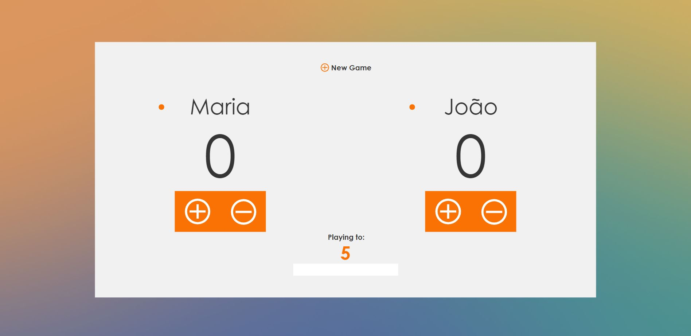
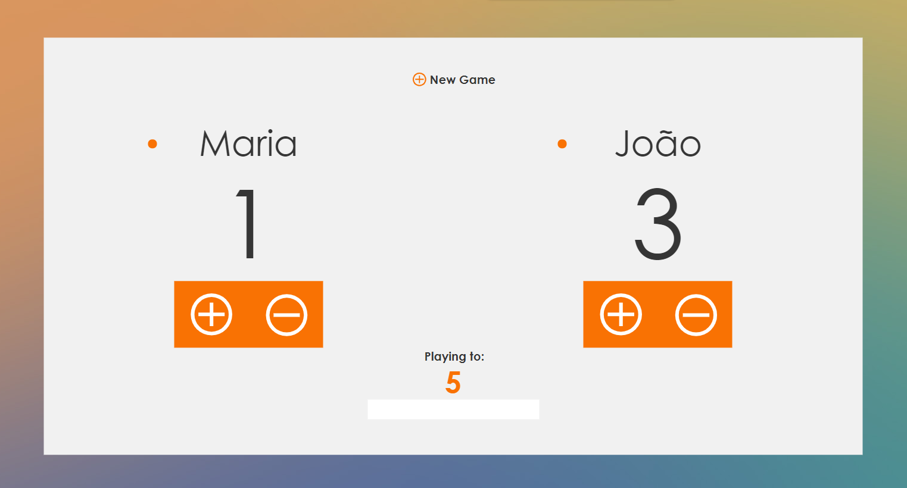

# SCOREGAME
Score Game is a responsive small app where you can score points when playing with friends.
## How it works ?
 1. First of all the app are going to ask for player 1 and player 2 names then as soon as you introduce the names it is going to be display them on screen.
 
 2. Change the max score point if you want to.The starter score is 5.
 3. As soon you score a point you can press the button plus(in case of double click, click minus button) to add a point.
 
 4. When reached the max score point you the user that lost is going to be grayed out
 
 5. Reset the game by clicking New Game button
